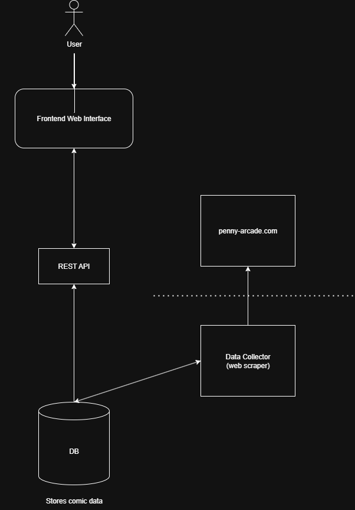

# Penny Arcade Full Text Search

Penny Arcade is a webcomic with over 25 years of material online at [penny-arcade.com](https://www.penny-arcade.com/). The topics covered in the comics span video games, philosophy, film, and parenting, among many others. Often, something in my daily life will remind me of a Penny Arcade strip, which makes me want to revisit a specific comic. I haven’t memorized all 4,000+ titles, though, so it’s often hard to find the strip I'm interested in. The official site provides a search option, but it doesn’t include the ability to search the actual text from the strip. I can often remember the specific punchline or dialogue that I want to find, so being able to search the actual text would be most beneficial to me. 

This project aims to solve that problem by extracting the text from every comic and storing it in a database for quick lookup. The frontend is a simple search box that allows for full-text search of Penny Arcade’s decades-spanning corpus. 

**Production site:** https://ihylts.com

---

## Tech Stack

- **Database:** PostgreSQL  
- **Services:** Python (collector & analyzer), Flask (REST API)  
- **OCR:** `pytesseract`  
- **Frontend:** React  
- **Metrics:** Prometheus

---

## Architecture Overview

- **Database** (Postgres) stores comics, OCR text, panel URLs, and metadata.  
- **Data Collector** crawls forward through comics and publishes new items to a queue.  
- **Data Analysis** fetches panels, runs OCR, sanitizes text, and updates the DB.  
- **REST API** exposes searchable data.  
- **Frontend** performs full-text search and highlights matches.  

---

## Data Collector (Python service)

1. Check the database for the most recent comic.  
2. Request the comic’s URL (seed with a hard-coded first-comic URL if DB is empty).  
3. Scrape the response for the **following** comic’s URL.  
4. Request the following comic.  
5. Extract title, publication date, and panel image URLs.  
6. Insert the new comic into the database.  
7. For each panel URL (one or more), request the image.  
8. Extract text with `pytesseract`.  
9. Sanitize/normalize the extracted text.  
10. Update the corresponding database record with the OCR results.

---

## REST API (Flask)

| Method | Path                     | Description                                     |
|------:|---------------------------|-------------------------------------------------|
|   GET | `/api/comics/searchable`  | Returns all comics as JSON for search/display.  |

---

## Frontend (React)

- Calls `/api/comics/searchable` and provides full-text search over **title** and **text**.  
- Highlights matching query terms in results.

---

## Architecture Diagram

